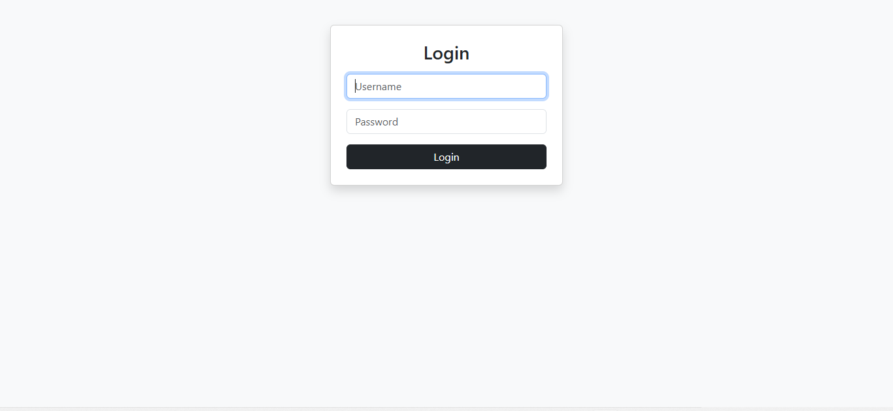
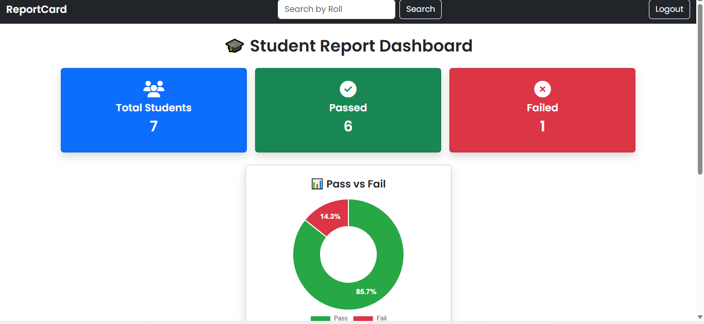
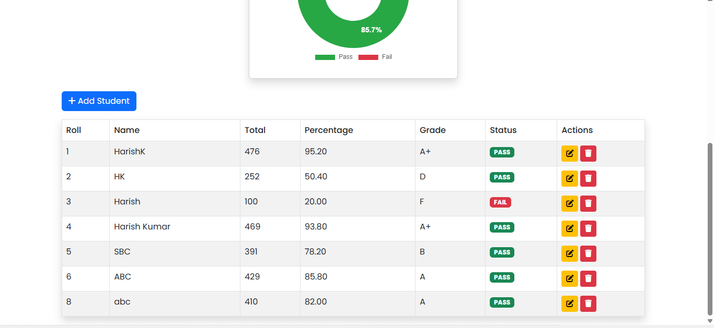
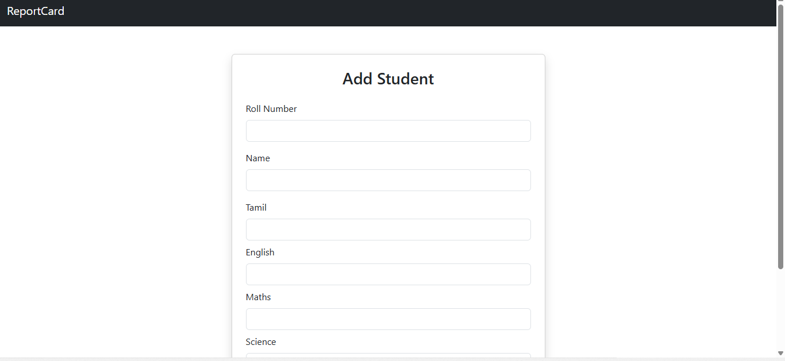
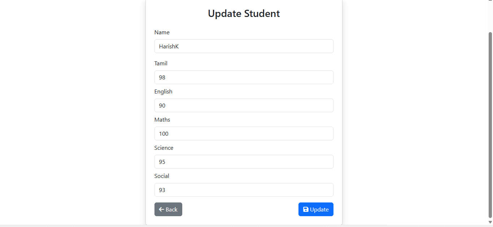
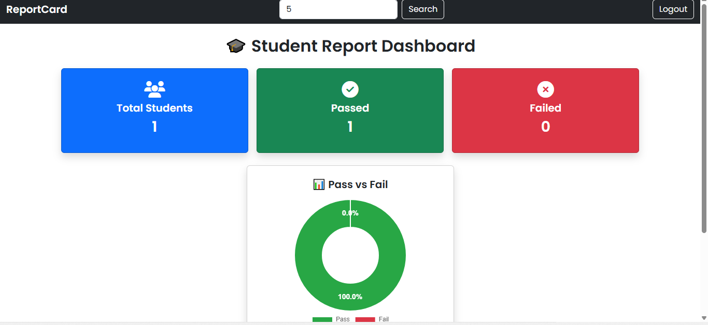

# ReportCard — Student Performance Dashboard

A Django web app for managing student academic records — add, update, and delete students, automatically compute grades and pass/fail status, and visualize class-wide performance with a live pass/fail chart.

---

## Screenshots

### Login
Login-protected access using Django's built-in auth system.


### Dashboard
Class-wide stats (total students, passed, failed) plus a live pass/fail doughnut chart.


### Student Records Table
Full student list with computed total, percentage, grade, and pass/fail status, plus edit/delete actions.


### Add Student
Server-side validated form for adding a new student record.


### Update Student
Edit an existing student's marks with the same validation rules as adding.


### Roll-Number Search
Search filters the dashboard down to an exact roll-number match, recalculating stats and the chart live.


---

## Features

- **Full CRUD** on student records — add, update, delete, all with server-side validation
- **Automatic grading** — total, percentage, and a 7-level letter grade (A+ through F) computed directly from marks, not stored redundantly
- **Subject-level pass/fail logic** — a student fails if *any single subject* falls below 35, not just on overall average, mirroring real academic grading rules
- **Roll-number search** — exact-match lookup by roll number, with correct numeric sort order (roll numbers are sorted as integers, not as strings, so "2" comes before "10")
- **Live pass/fail visualization** — a Chart.js doughnut chart showing real-time pass/fail counts and percentages, computed dynamically from the database
- **Login-protected views** — all data views require authentication via Django's built-in auth system
- **Duplicate protection** — roll numbers are enforced unique at both the form-validation and database level

---

## Tech Stack

| Layer | Technology |
|---|---|
| Backend | Django 5 |
| Database | SQLite |
| Frontend | Django templates, Bootstrap 5, Font Awesome |
| Charts | Chart.js + chartjs-plugin-datalabels |

---

## How Grading Works

```python
# Status: fails if ANY subject is below 35 — not average-based
status = "FAIL" if any(mark < 35 for mark in [tamil, english, maths, science, social]) else "PASS"

# Grade: based on percentage across 5 subjects
percentage >= 90 → A+
percentage >= 80 → A
percentage >= 70 → B
percentage >= 60 → C
percentage >= 50 → D
percentage >= 35 → E
percentage <  35 → F
```

Both `status` and `grade` are computed as model properties rather than stored fields, so they're always consistent with the underlying marks — no risk of stale/out-of-sync data.

---

## Setup & Installation

```bash
# Clone the repo
git clone https://github.com/hkrns523-creator/student-performance-dashboard.git
cd student-performance-dashboard/project

# Create and activate a virtual environment
python -m venv venv
source venv/bin/activate        # Windows: venv\Scripts\activate

# Install dependencies
pip install django

# Run migrations
python manage.py migrate

# Create a superuser (needed to log in — the app is login-protected)
python manage.py createsuperuser

# Start the development server
python manage.py runserver
```

Then visit `http://127.0.0.1:8000/login/` and sign in with the superuser account you created.

---

## Project Structure

```
project/
├── core/           # Django project settings, root URLs
├── students/       # Main app — models, views, urls
│   ├── models.py   # Student model with grade/status/total as computed properties
│   ├── views.py    # CRUD views + login/logout
│   └── urls.py
├── templates/       # index, add, update, login templates
└── db.sqlite3
```

---

## Known Limitations

- Search currently supports exact roll-number match only but no partial or name-based search yet
- `DEBUG = True` and a hardcoded fallback `SECRET_KEY` are fine for local development but would need to be moved to environment variables before any real deployment
- No automated test suite yet
- No pagination such as the student list renders all records on one page, which would need addressing at larger scale

---

## License

This project was built as a personal learning project. Feel free to explore the code for reference.
